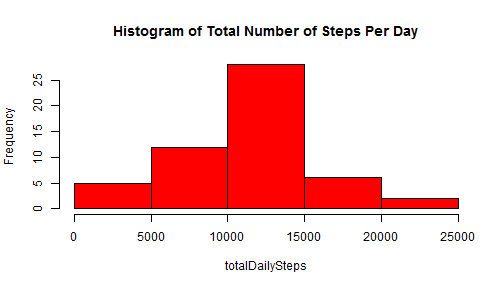

# Reproducible Research: Peer Assessment 1

### Loading and preprocessing the data

Load the data from the csv file:

```r
#setwd("repdata-data-activity")
data = read.csv("activity.csv")
```

Convert the date data into the Date class format:

```r
data$date <- as.Date(data$date, format = "%Y-%m-%d")
```

### What is mean total number of steps taken per day?

Create a histogram of the total number of steps taken each day, 
ignoring the missing values in the dataset:

```r
totalDailySteps <- with(data, tapply(steps, factor(date), sum))
hist(totalDailySteps, main = "Histogram of Total Number of Steps Per Day", col = "red")
```

 

Calculate and report the **mean** and **median** total number of steps taken per day:

```r
meanSteps <- mean(totalDailySteps, na.rm = TRUE)
meanSteps
```

```
## [1] 10766
```

```r
medianSteps <- median(totalDailySteps, na.rm = TRUE)
medianSteps
```

```
## [1] 10765
```
Mean number of steps per day: **1.0766 &times; 10<sup>4</sup>**  
Median number of steps per day: **10765**

### What is the average daily activity pattern?

Create the time series plot of the 5-minute interval and the average number of steps taken, 
averaged across all days:

```r
avgIntervalSteps <- with(data, tapply(steps, factor(interval), mean, na.rm = TRUE))
plot(as.numeric(names(avgIntervalSteps)), avgIntervalSteps, type = 'l', 
     xlab = " Time Interval (minutes)", ylab = "Average Number of Steps",
     main = "Average steps per time interval across all days")
```

 

Calculate the 5-minute interval that contains the maximum number of steps, averaged across all the days in the dataset: 

```r
index <- which.max(avgIntervalSteps)
maxAvgInterval <- names(index)
maxAvgInterval
```

```
## [1] "835"
```

The 5-minute interval that contains the max number of steps starts at **835** minutes.

### Imputing missing values

Note that there are a number of days/intervals where there are missing
values (coded as `NA`). The presence of missing data may introduce
bias into some calculations or summaries of the data.

Calculate and report the total number of missing values in the dataset (i.e. the total number of rows with `NA`s):

```r
nRowsNA <- nrow(subset(data, is.na(steps) | is.na(interval) | is.na(date)))
nRowsNA
```

```
## [1] 2304
```
The total number of rows in the data set with NA values is **2304**.

Use the mean across all days for a given 5-minute interval to fill NA values.
Create a new dataset that is equal to the original dataset but with the missing data replaced:

```r
dataComplete <- data

for (i in 1:nrow(dataComplete)){
    if (is.na(dataComplete$steps[i])){
        dataComplete$steps[i] <- avgIntervalSteps[as.character(dataComplete$interval[i])]
    } 
}
```

Make a histogram of the total number of steps taken each day with NAs replaced:

```r
totalDailyStepsFilled <- with(dataComplete, tapply(steps, factor(date), sum))
hist(totalDailyStepsFilled, main = "Histogram of Total Number of Steps Per Day (NA values filled)", col = "blue")
```

 

Calculate the **mean** and **median** total number of steps taken per day: 

```r
meanStepsFilled <- mean(totalDailyStepsFilled)
medianStepsFilled <- median(totalDailyStepsFilled)
```
Mean number of steps per day (no NAs): **1.0766 &times; 10<sup>4</sup>**  
Median number of steps per day (no NAs): **1.0766 &times; 10<sup>4</sup>**

The mean and median values **do not differ** from the estimates from the first part of the assignment. 
There is no evident impact of imputing missing data on the estimates of the mean and median daily steps when using filled in data.  However, the daily totals **do differ** because they are higher for the filled data.

### Are there differences in activity patterns between weekdays and weekends?

Create a new factor variable in the dataset with two levels -- "weekday" and "weekend" indicating whether a given date is a weekday or weekend day:

```r
dow <- weekdays(dataComplete$date)
dow[!(dow == "Saturday" | dow == "Sunday")] <- "weekday"
dow[(dow == "Saturday" | dow == "Sunday")] <- "weekend"
dataComplete$dow <- dow
```

Make a panel plot containing a time series plot (i.e. `type = "l"`) of the 5-minute interval (x-axis) and the average number of steps taken, averaged across all weekday days or weekend days (y-axis):

```
## Warning: package 'reshape' was built under R version 3.1.1
```

```r
library(lattice)
avgSteps <- with(dataComplete, tapply(steps, list(factor(interval),factor(dow)), mean, na.rm = TRUE))
df <- data.frame(as.numeric(rownames(avgSteps)), avgSteps)
colnames(df)[1] <- "Interval"
avgStepsLong <- melt(df,id = "Interval", variable_name = "dayOfWeek")
xyplot(value ~ Interval | dayOfWeek, data = avgStepsLong, type = 'l', layout = c(1,2)) 
```

 


